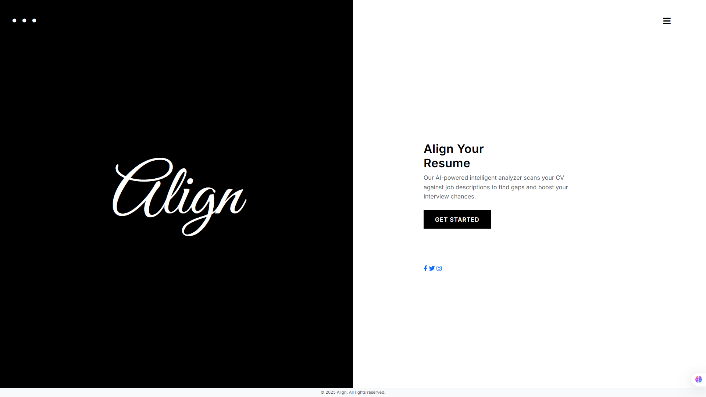
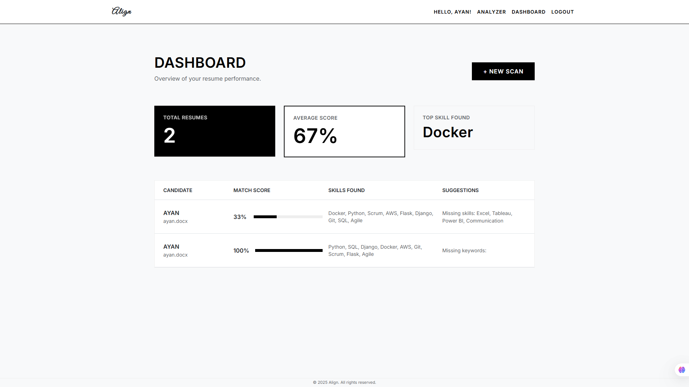
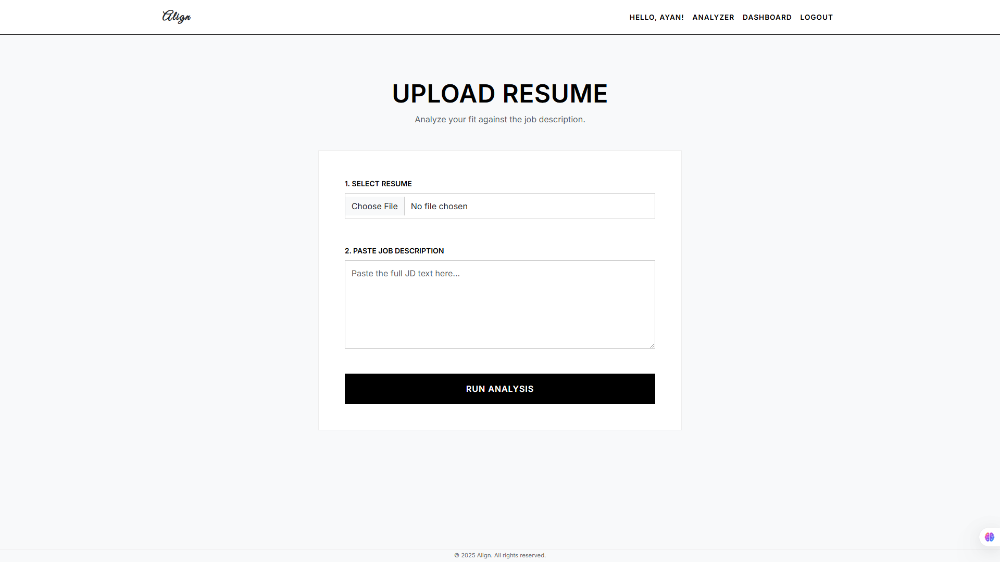

# Align | Intelligent Resume Analyzer


**Align** is a modern, full-stack **Applicant Tracking System (ATS)** tool designed to bridge the gap between job seekers and recruitment algorithms.

Built with **Python (Flask)** and **MySQL**, it uses Natural Language Processing (NLP) to parse resumes, match them against job descriptions, and provide real-time scoring and keyword suggestions to help candidates get hired.

---

## Screenshots

| Landing Page | Dashboard | Analysis Tool |
|:---:|:---:|:---:|
|  |  |  |


---

## Key Features

* **User Authentication:** Secure Login and Registration system with session management.
* **Resume Parsing:** Automatically extracts text and metadata from **PDF** and **DOCX** files.
* **Smart Matching:** Compares resume keywords against Job Descriptions (JD) to calculate a compatibility score (0-100%).
* **AI Suggestions:** Identifies missing keywords and skills required for the job.
* **Analytics Dashboard:** Tracks application history, average scores, and top skills in a clean, monochrome interface.
* **Modern UI:** Features a high-contrast "Split-Screen" landing page and a professional "Black & White" functional dashboard.

---

## Tech Stack

* **Frontend:** HTML5, CSS3, Bootstrap 5, Jinja2 Templating.
* **Backend:** Python 3.x, Flask (Micro-framework).
* **Database:** MySQL (Relational Data Storage).
* **NLP Logic:** Custom Keyword Matching Algorithm, Set Theory Intersection.
* **Libraries:** `PyPDF2`, `python-docx`, `mysql-connector-python`.

---

## Installation & Setup

Follow these steps to run the project locally.

### 1. Clone the Repository
```bash
git clone [https://github.com/yourusername/Align_Resume_Analyzer.git](https://github.com/yourusername/Align_Resume_Analyzer.git)
cd Align_Resume_Analyzer
```
### 2. Set Up Virtual Environment (Optional but Recommended)
```bash
python -m venv venv
# Windows
venv\Scripts\activate
# Mac/Linux
source venv/bin/activate
```
### 3. Install Dependencies
```bash
pip install -r requirements.txt
```
### 4. Database Configuration
* Open MySQL Workbench or your terminal.

* Open the file database_schema.sql provided in this repository.

* Run the script to create the ResumeDB database, tables, and populate the Skill_Master dictionary.

### 5. Connect Python to MySQL
The project requires a database configuration file that is not included in the repo for security.
* Create a new file named db_config.py in the root folder
* Paste the following code and update your password:
  ```bash
  db_config = {
    'host': 'localhost',
    'user': 'resume_admin',      # or 'root'
    'password': 'YOUR_PASSWORD', # Your MySQL Password
    'database': 'ResumeDB'
  }
  ```
### 6. Run the Application
```bash
python app.py
```
## Project Structure
```text
/Align_Resume_Analyzer
│
├── app.py                 # Main Flask Application Controller
├── resume_parser.py       # NLP Logic for Text Extraction & Matching
├── db_config.py           # Database Connection Settings (Ignored by Git)
├── database_schema.sql    # SQL Script to setup the database
├── requirements.txt       # List of Python dependencies
│
├── static/                # CSS, Images, Logo
│   ├── style.css          # Master Stylesheet (Global/Split/Dashboard themes)
│   └── logo.png
│
├── templates/             # HTML Files
│   ├── layout.html        # Base template (Navbar/Footer)
│   ├── index.html         # Landing Page (Split Screen)
│   ├── login.html         # Login Page
│   ├── register.html      # Register Page
│   ├── analyze.html       # Upload Tool
│   └── dashboard.html     # Results & History
│
└── uploads/               # Stores uploaded resumes locally
```
## Future Scope
* **Machine Learning Integration:** Implementing TF-IDF or Word2Vec for deeper semantic matching (understanding context, not just keywords).

* **Social Login:** Adding Google/LinkedIn authentication.

* **PDF Report Export:** Allowing users to download a PDF report of their analysis.

* **Job Scraper:** Automatically fetching job descriptions from LinkedIn/Indeed.

## Contributing
Contributions are welcome! Please fork the repository and create a pull request.

## License
This project is open-source and available under the MIT License.

